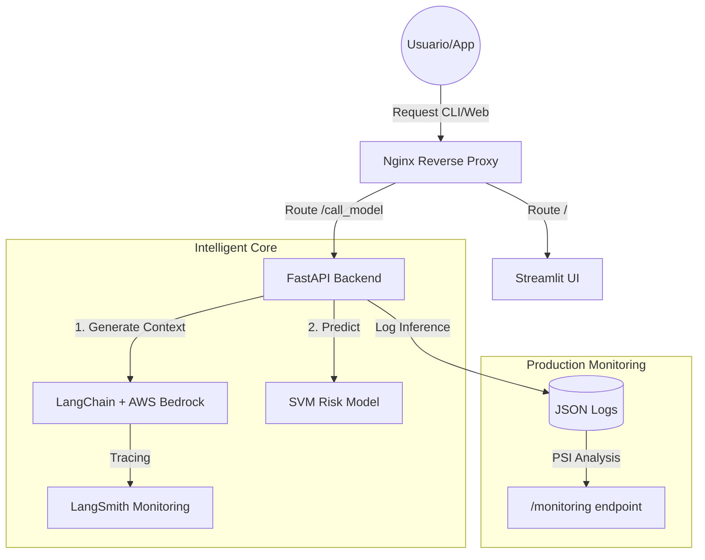

# 🏦 End-to-End Credit Risk Intelligence System

Este proyecto representa una solución integral de **MLOps** para la evaluación de riesgo crediticio, integrando inteligencia artificial generativa (GenAI), aprendizaje automático tradicional y sistemas avanzados de monitoreo en producción.

---

## 🚀 Descripción del Proyecto

El sistema automatiza la evaluación de riesgo para solicitantes de crédito, aportando dos capas de inteligencia:
1.  **Capa Predictiva (ML)**: Determina si un cliente es de "Buen" o "Mal" riesgo usando un modelo SVM.
2.  **Capa Generativa (GenAI)**: Proporciona un análisis narrativo del perfil del cliente en lenguaje natural, actuando como un "asistente de riesgos".

### 🛠 Tech Stack
- **Backend**: FastAPI (Python)
- **Frontend**: Streamlit
- **GenAI/Observability**: LangChain, LangSmith, AWS Bedrock (Titan Express)
- **ML Core**: Scikit-Learn (SVC), Pandas, Joblib
- **DevOps**: Docker, Nginx, GitHub Actions
- **Monitoring**: PSI (Population Stability Index) para detección de Drift.

---

## 🏗 Arquitectura del Sistema



---

## 📊 Datos y Enriquecimiento

### Dataset Original
Se basa en el conjunto de datos de riesgo crediticio alemán, que incluye variables como:
- **Demográficas**: Edad (Age), Sexo (Sex).
- **Financieras**: Cuentas de ahorro (Saving accounts), Cuenta corriente (Checking account), Monto (Credit amount).
- **Contextuales**: Finalidad (Purpose), Duración (Duration).

### Enriquecimiento con GenAI (LangChain)
Antes de la predicción, el sistema envía los datos a **AWS Bedrock**. LangChain orquesta este flujo para generar una descripción de máximo 30 palabras que resume el perfil del cliente desde la perspectiva de un experto bancario. Todas estas llamadas se monitorean en **LangSmith** para evaluar latencia y calidad del prompt.

---

## 📉 Monitoreo de Producción (MLOps)

El sistema incluye una suite de monitoreo profesional diseñada para entornos bancarios:

### 1. Population Stability Index (PSI)
Calculamos el PSI para detectar **Data Drift**. Comparamos los histogramas de las variables en producción contra la línea base del entrenamiento:
- **PSI < 0.1**: Estable ✅
- **0.1 - 0.2**: Alerta de cambio ⚠️
- **PSI > 0.2**: Drift detectado (requiere re-entrenamiento) 🚨

### 2. Prediction Drift
Monitorea cambios en la tasa de "Bad Risk" generada por el modelo para detectar cambios inesperados en las aprobaciones de crédito.

---

## 📦 Instalación y Ejecución

### 💻 Localmente
1.  **Clonar y Entorno**:
    ```bash
    git clone https://github.com/kevinGmezIoT/credit-risk-reto.git
    cd credit-risk-reto
    pip install -r requirements.txt
    ```
2.  **Entrenar el Modelo**:
    ```bash
    python src/models/train.py
    ```
3.  **Lanzar Servicios** (Requiere 2 terminales):
    - `uvicorn main:app --port 8000` (API)
    - `streamlit run app.py` (Web)

### 🐳 Docker (Recomendado)
El proyecto usa Nginx como proxy para servir ambos servicios en el puerto `7860`.
```bash
docker build -t credit-risk-app .
docker run -p 7860:7860 --env-file .env credit-risk-app
```

---

## 🚢 Despliegue CI/CD

El despliegue está automatizado con **GitHub Actions**:
1.  **Continuous Training**: Cada vez que haces un `push` a `master`, el workflow entrena el modelo de nuevo con los últimos datos proporcionados.
2.  **Versioning**: Sube el modelo (`.joblib`) y la línea base (`train_features.csv`) a Hugging Face Spaces.
3.  **Dockerization**: Construye y despliega el contenedor en Hugging Face automáticamente.

### 🔐 Secretos Necesarios (En HF/GitHub)
- `HF_TOKEN`: Para el despliegue.
- `LANGCHAIN_API_KEY`: Para monitoreo de GenAI.
- `AWS_ACCESS_KEY_ID` / `AWS_SECRET_ACCESS_KEY`: Para conectarse a Bedrock.

---

## 🔗 Enlaces de Verificación en Producción
- **Interfaz Web**: [Tu Space URL]
- **API Swagger**: `[URL]/docs`
- **Dashboard de Salud**: `[URL]/monitoring`

---
**Kevin Gómez Villanueva** | Proyecto Final de Especialización en GenAI
